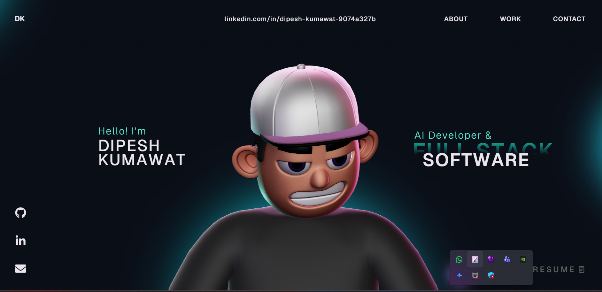

# 3D Portfolio Website

This repository contains the source code for a personal 3D portfolio built with React, TypeScript, Three.js, React Three Fiber, and GSAP. It includes animated page sections, a character scene, custom cursor interactions, and smooth transitions designed for a modern portfolio experience.

Live site: (https://dipesh-kumawat.vercel.app/)



## Table of Contents

- [Features](#features)
- [Tech Stack](#tech-stack)
- [Project Structure](#project-structure)
- [Getting Started](#getting-started)
- [Available Scripts](#available-scripts)
- [GSAP License Note](#gsap-license-note)
- [Customization Guide](#customization-guide)
- [Troubleshooting](#troubleshooting)
- [Deployment](#deployment)
- [License](#license)

## Features

- Responsive one-page portfolio layout with reusable section components.
- 3D character scene rendering powered by React Three Fiber and Three.js.
- GSAP-powered animations and transitions for interactive storytelling.
- Custom cursor, hover interactions, and scroll-driven visual effects.
- Organized component architecture with dedicated utilities and style modules.

## Tech Stack

### Core

- React 18
- TypeScript
- Vite

### Animation and 3D

- GSAP + `@gsap/react`
- Three.js
- `@react-three/fiber`
- `@react-three/drei`
- `@react-three/postprocessing`
- `@react-three/cannon`
- `@react-three/rapier`

### Supporting Libraries

- `react-icons`
- `react-fast-marquee`
- `@vercel/analytics`

## Project Structure

```text
.
├── public/                    # Static assets
├── src/
│   ├── assets/                # Local media/assets
│   ├── components/
│   │   ├── Character/         # 3D scene + character logic/utilities
│   │   ├── styles/            # Section/component CSS files
│   │   ├── About.tsx
│   │   ├── Career.tsx
│   │   ├── Contact.tsx
│   │   ├── Landing.tsx
│   │   ├── MainContainer.tsx  # Main page composition
│   │   ├── Navbar.tsx
│   │   ├── TechStack.tsx
│   │   ├── WhatIDo.tsx
│   │   └── Work.tsx
│   ├── context/               # Global providers (loading state, etc.)
│   ├── data/                  # Static data/content definitions
│   ├── App.tsx
│   └── main.tsx
├── package.json
└── vite.config.ts
```

## Getting Started

### Prerequisites

- Node.js 18+ (recommended)
- npm 9+ (or compatible)


## GSAP License Note

This project uses the standard `gsap` package, including bonus plugins now available in the core package.

- Install dependencies with `npm install`.
- If migrating from older setups, remove `gsap-trial` from your project.

Read official installation guidance here: [GSAP Installation Docs](https://gsap.com/docs/v3/Installation/)


This project is open source and available under the [MIT License](LICENSE).
